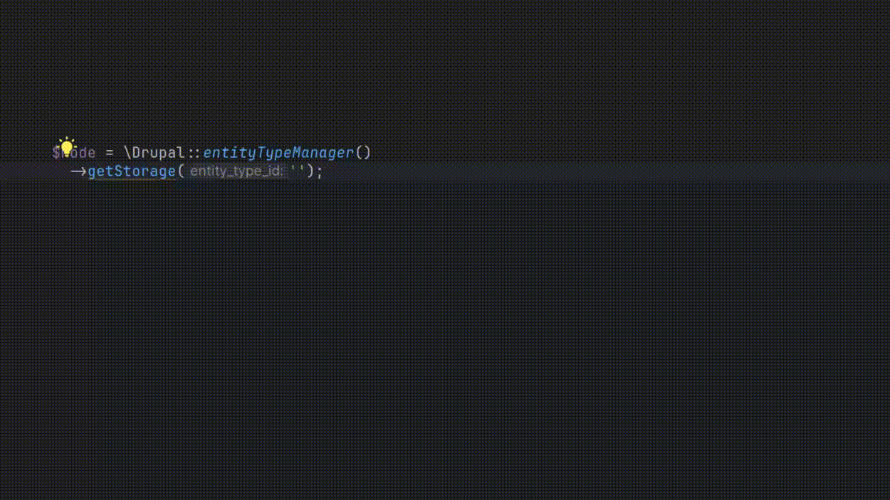
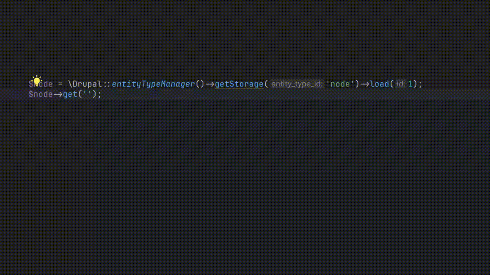
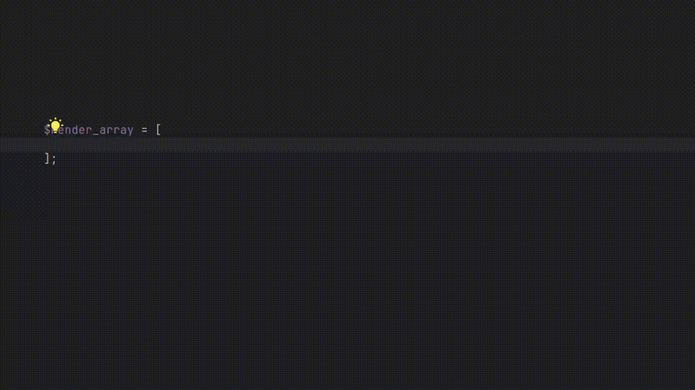
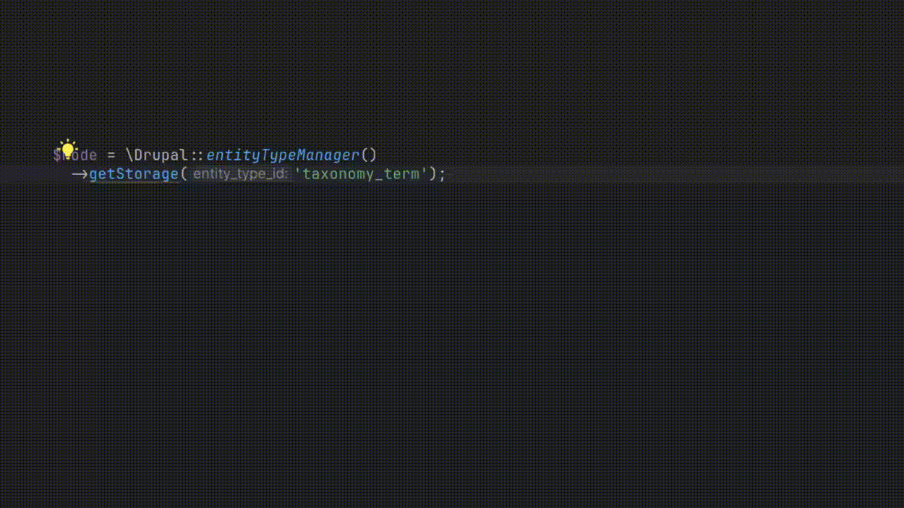
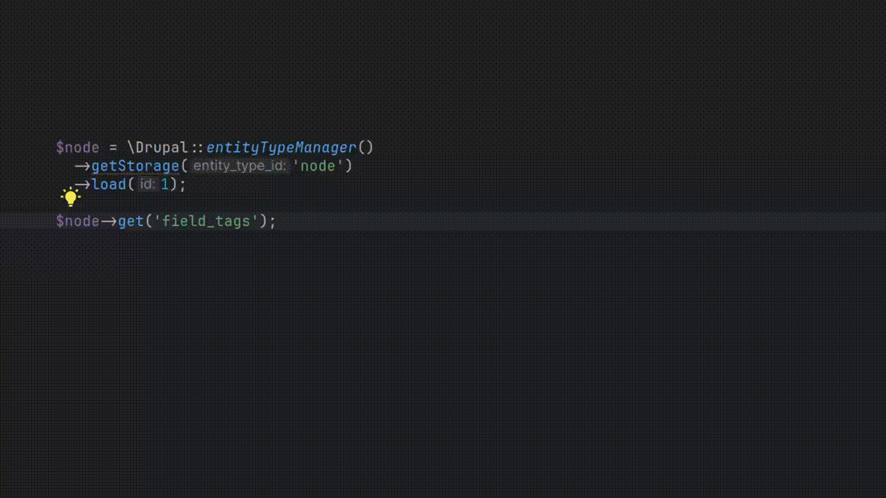
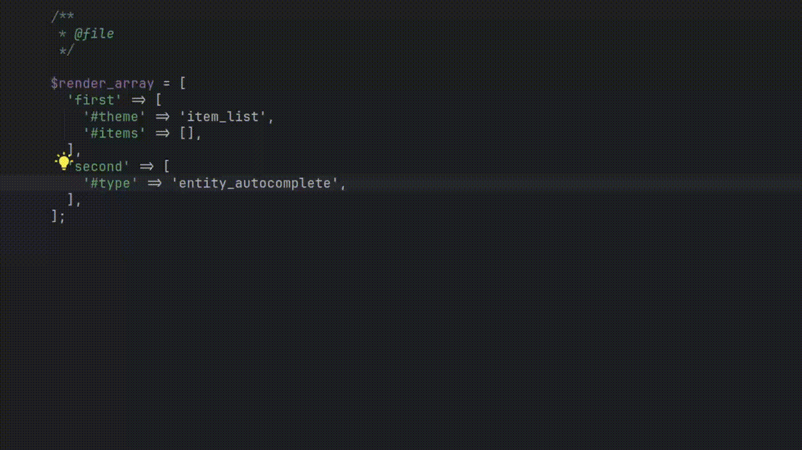
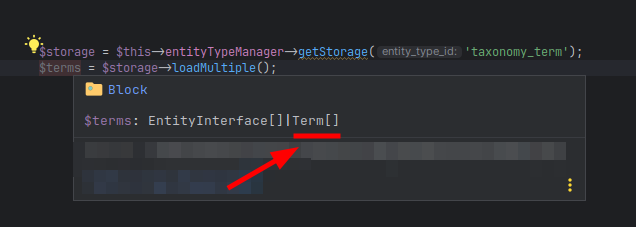
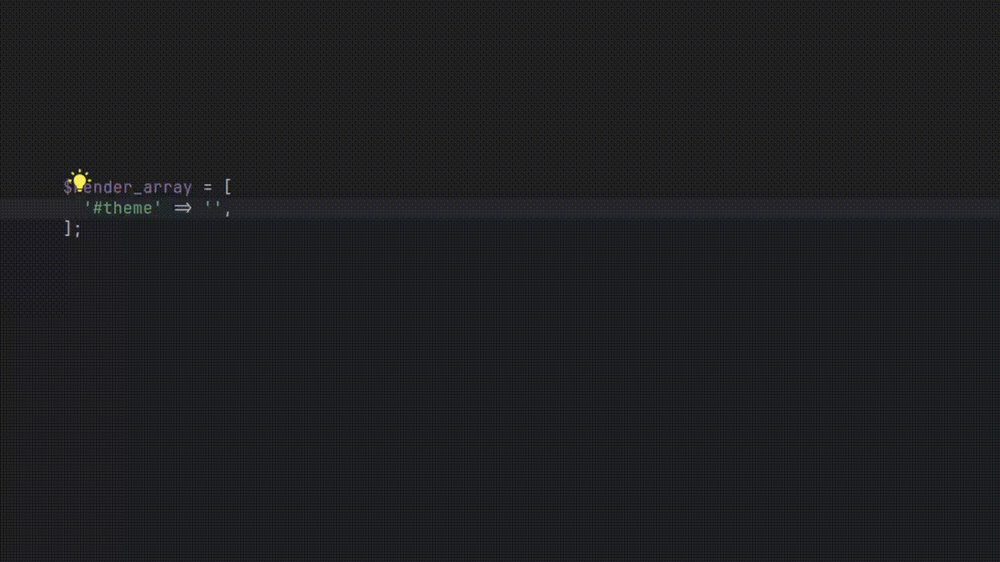

# drupal-extend

The plugin is enhancement for your Drupal development experience.

## Features
* Autocomplete for Content/Config Entities Storage (eck support)

* Fields autocomplete (default configuration directory points to the `config/sync` directory, you can change it inside plugin settings. <kbd>Settings</kbd> -> <kbd>PHP</kbd> -> <kbd>Drupal Extend</kbd>)
  

* Field properties autocomplete e.g. `$node->get('field_user')->en|` it will autocomplete **entity** in this case.

* Autocomplete for render element types and their properties.
  

* Storage reference provider
  

* Fields reference provider
  

* Reference provider for Render element types and themes.
  

* Entity Type Provider for `$storage->load/loadMultiple/loadByProperties`
  

* Type Provider for static `Node::load/create/loadMultiple` methods

* Type Provider for `\Drupal::service('')`

* Autocomplete for `#theme`
  

* Render element type and theme highlight (Annotator)

* Fields autocomplete in content entity queries and entity storages autocomplete in `\Drupal::entityQuery()`

## Installation

- Using the IDE built-in plugin system:
  
  <kbd>Settings/Preferences</kbd> > <kbd>Plugins</kbd> > <kbd>Marketplace</kbd> > <kbd>Search for "drupal-extend"</kbd> >
  <kbd>Install</kbd>
  
- Manually:

  Download the [latest release](https://github.com/nvelychenko/drupal-extend/releases/latest) and install it manually using
  <kbd>Settings/Preferences</kbd> > <kbd>Plugins</kbd> > <kbd>⚙️</kbd> > <kbd>Install plugin from disk...</kbd>
